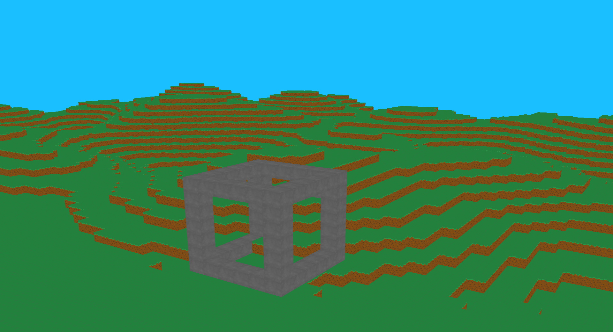

# OpenGL Minecraft Clone
This project demonstrates advanced skills in designing and implementing complex systems using C++, OpenGL, and Make. It features a functional prototype of infinite world generation inspired by Minecraft, including dynamic chunk loading/unloading, user navigation, and block placement. Developed with a focus on performance and optimization, it is intended to run efficiently on Linux. The source code showcases expertise in graphics programming, resource management, and systems development. The project is implemented using C++17.



## Installation and Compilation

Ensure you have C++ build tools, GLFW, and glm installed. On Ubuntu or Debian-based systems, run:

```bash
sudo apt update
sudo apt install build-essential libglfw3-dev libglm-dev libxi-dev
```

To build the project, use:

```bash
make
```

This will create the executable at `./build/game`. To clean up generated files, run:

```bash
make clean
```